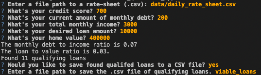

# Loan Qualifer App

Python based app to help clients find loans that fit their financial situaion.  

---

## Technologies

This project leverages pytho3 with the following packages:

* [fire](https://pypi.org/project/fire/) - For loading and saving files from and to specefic paths.

* [questionary](https://pypi.org/project/questionary/) - For plotting and organizing data.

* [pathlib](https://pypi.org/project/pathlib/) - For math. 

---

## Installation Guide

Before running the application first install the following.

```python
  pip install fire
  pip install questionary
  pip install pathlib
```

---

## Usage

Open the folder in an IDE and then proceed to run app.py. 




---

## Contributors

Made by Owen Wardlaw : owardlaw@ucsd.edu.
---

## License

MIT
