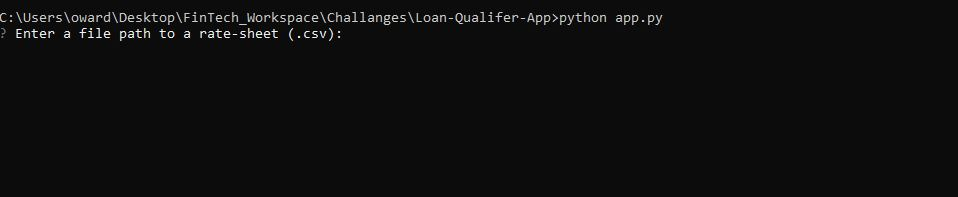

# Loan Qualifer App

This is a python command-line interface application that allows users to see qualifying loans from lenders based on input. The application works by taking in a `daily_rate_sheet` of criteria from various loan providers, then promping the user to input personal relevant information, and returning a set of avaliable loans with an option to save those loans to a specefic path.

---

## Technologies

This project leverages python 3.7 with the following packages:

* [pathlib](https://github.com/python/cpython/blob/main/Lib/pathlib.py) - For loading and saving files from and to specefic paths.

* [fire](https://github.com/google/python-fire) - For the command line interface, help page, and entrypoint.

* [questionary](https://github.com/tmbo/questionary) - For interactive user prompts and dialogs

---

## Installation Guide

Before running the application first install the following.

```python
  pip install pathlib
  pip install fire
  pip install questionary
```

---

## Usage


To use the loan qualifier application simply clone the repository and run the **app.py** with:

```python
python app.py
```

Upon launching the loan qualifier application you will be greeted with the following prompt, proceed through the following steps.




---

## Contributors

Made by Owen Wardlaw owardlaw@ucsd.edu.
---

## License

MIT
